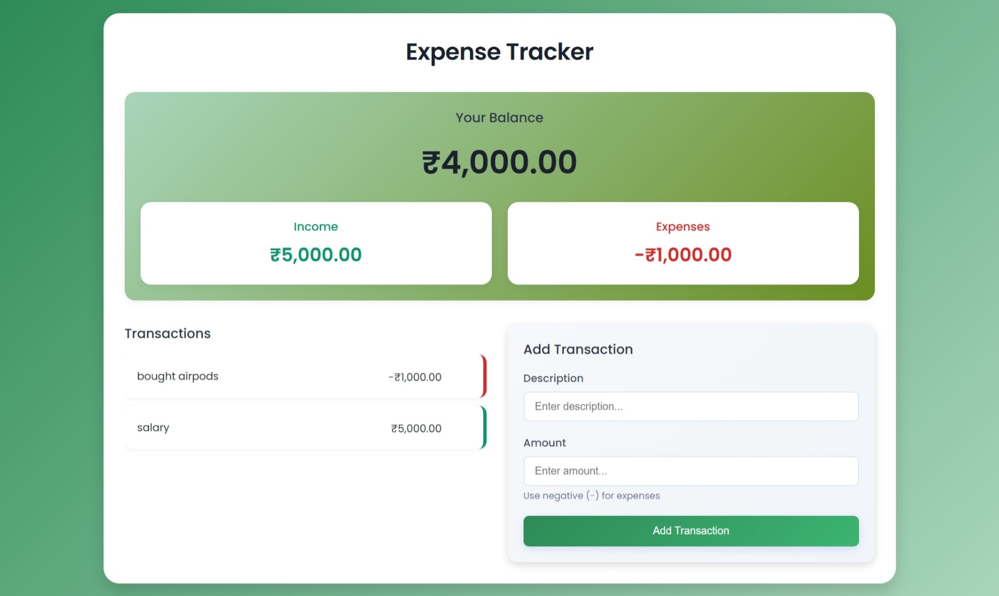
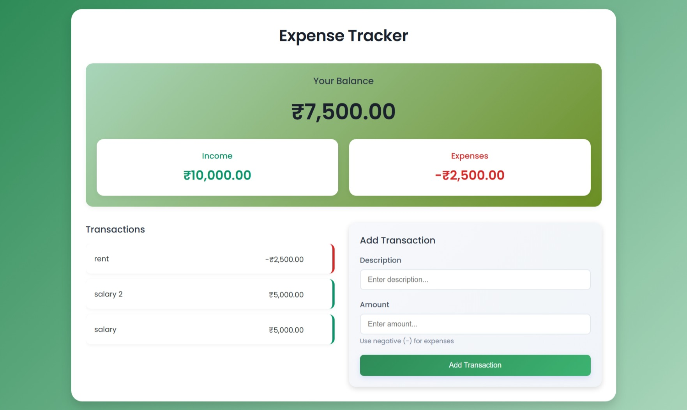

# 💰 Expense Tracker

A responsive Expense Tracker web application built using HTML, CSS, and JavaScript. The app allows users to add income and expenses, calculate balance automatically, and store data permanently using Local Storage.

---

## 📸 Screenshots

### Home Screen


### Adding Transactions



### Updated Summary



---

## ✨ Features

- Add Income
- Add Expenses
- Delete Transactions
- Real-time Balance Calculation
- Income & Expense Summary
- Local Storage Support
- Responsive Design
- Clean UI

---

## 🛠️ Built With

- HTML5
- CSS3
- JavaScript (ES6)
- Local Storage API

---

## 📂 Project Structure

```
expense-tracker/
│
├── index.html
├── style.css
├── script.js
├── README.md
└── assets/
    ├── screenshot-1.jpeg
    ├── screenshot-2.jpeg
    └── screenshot-3.jpeg
```

---

## 📚 What I Learned

- DOM Manipulation
- Event Handling
- Arrays
- Objects
- Array Methods
  - filter()
  - reduce()
- Local Storage
- Dynamic UI Rendering
- Currency Formatting
- Form Validation

---

## 👨‍💻 Author

MOHD AMAN

GitHub:
https://github.com/mohdaman-codes
